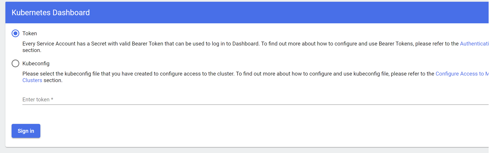
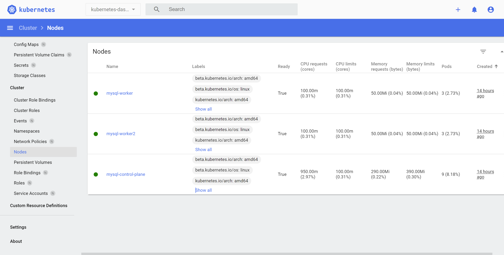

# Setup

This section aims to provide a step-by-step guide to setting up a vanilla local k8s cluster. This is not a production-ready setup, but it is a good way to understand the pipeline proposed in **PerfCE**. For readers who have possessed a k8s cluster, they can adjust their cluster to meet the requirements of **PerfCE**. Note that for the sake of convenience, we don't present all config files in this website. You can find them in the [GitHub repository](https://github.com/ZhenlanJi/PerfCE/tree/main/config_files/setup).

## Prerequisites
Our experiments were performed on a server with Ubuntu 18.04 LTS (x86\_64). Although **PerfCE** is not limited to this environment, we recommend using the same environment to avoid potential compatibility issues. 
The following packages are required:
- [docker](https://docs.docker.com/engine/install/ubuntu/)
- [kubectl](https://kubernetes.io/docs/tasks/tools/install-kubectl/)
- [kind](https://kind.sigs.k8s.io/docs/user/quick-start/)


## k8s Cluster Setup 

### 1. Create a k8s cluster with kind

**Step 1:** Configure the kind Cluster in file <u>cluster-3nodes.yml</u>.
```yaml
# three node (two workers) cluster config
kind: Cluster
apiVersion: kind.x-k8s.io/v1alpha4
nodes:
- role: control-plane
- role: worker
- role: worker
```

**Step 2:** Run the following command to create the cluster:
```bash
kind create cluster --name $cluster_name --config kind-config.yml
```
> **Note:** The creating process may take a few minutes. Please wait patiently. If you encounter any errors, please refer to the kind [documentation](https://kind.sigs.k8s.io/docs/user/quick-start/) for troubleshooting.

### 2. Install k8s Dashboard

**Step 1:** Deploy the k8s dashboard by running the following command:
```bash
kubectl apply -f https://raw.githubusercontent.com/kubernetes/dashboard/v2.5.0/aio/deploy/recommended.yaml
```

**Step 2:** Port forward the k8s dashboard to localhost:
```bash
kubectl port-forward -n kubernetes-dashboard svc/kubernetes-dashboard 10443:443 --address 0.0.0.0
```
> **Note:** The port number can be changed to any available port number. For users who setup this cluster on a remote server, please make sure that the port is accessible.

**Step 3:** Access the k8s dashboard by visiting [https://localhost:10443](https://localhost:10443) in your browser. You will be prompted to enter a token to login like the following image.


**Step 4:** Create service account via a yaml file <u>dashboard-adminuser.yml</u>:
```yaml
apiVersion: v1
kind: ServiceAccount
metadata:
  name: admin-user
  namespace: kubernetes-dashboard
```
Run the following command to create the service account:
```bash
kubectl apply -f dashboard-adminuser.yml
```

**Step 5:** Create a cluster role binding via a yaml file <u>adminuser-rolebinding.yml </u>:
```yaml
apiVersion: rbac.authorization.k8s.io/v1
kind: ClusterRoleBinding
metadata:
  name: admin-user
roleRef:
  apiGroup: rbac.authorization.k8s.io
  kind: ClusterRole
  name: cluster-admin
subjects:
- kind: ServiceAccount
  name: admin-user
  namespace: kubernetes-dashboard
```
Run the following command to create the cluster role binding:
```bash
kubectl apply -f adminuser-rolebinding.yml
```

**Step 6:** Get the token of the service account:
```bash
kubectl -n kubernetes-dashboard describe secret $(kubectl -n kubernetes-dashboard get secret | grep admin-user | awk '{print $1}')
```
Copy the token and paste it to the login page. You will be able to access the k8s dashboard. The following image shows the dashboard of Nodes.


### 3. Install Chaos-Mesh
To conduct chaos engineering experiments, we use [Chaos-Mesh](https://chaos-mesh.org/). Chaos-Mesh is a cloud-native, powerful chaos engineering platform for kubernetes. You can also refer to the [Chaos-Mesh documentation](https://chaos-mesh.org/docs/production-installation-using-helm/) for installation.

Before installing Chaos Mesh, make sure that you have installed Helm in your environment. You can refer to the [Helm documentation](https://helm.sh/docs/intro/install/) for installation.

**Step 1:** To see charts that can be installed, execute the following command:
```bash
helm search repo chaos-mesh
```
After the above command is completed, you can start installing Chaos Mesh.

> **Note**: In our experiments, we use Chaos Mesh v2.1.3. If you want to use other versions, please change the version number in the following commands. `helm search repo chaos-mesh -l`

**Step 2:** Create the namespace to install Chaos Mesh by running the following command:
```bash
kubectl create ns chaos-testing
```

**Step 3:** Install Chaos Mesh repository by running the following command:
```bash
helm install chaos-mesh chaos-mesh/chaos-mesh -n=chaos-testing --version 2.1.3
```
You can check the installation status in the k8s dashboard or by running the following command:
```bash
kubectl get po -n chaos-testing
```


### 4. Install Prometheus

## TiDB Setup


## MySQL Setup Tutorial